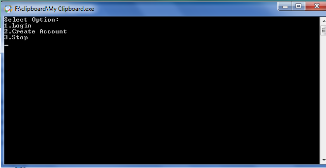
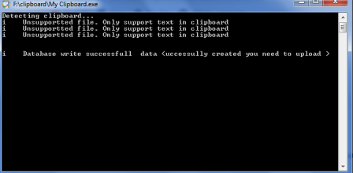
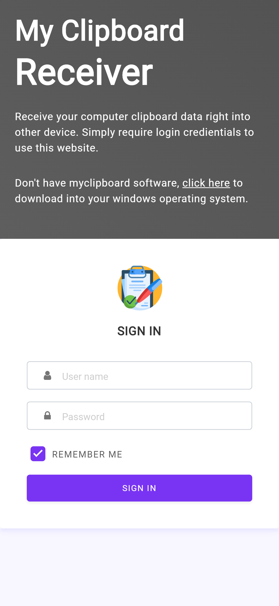
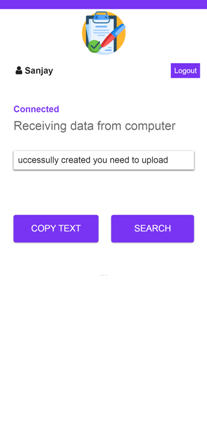

# MyClipboard

share your clipboard data into other devices in realtime.

## Getting Started

This project is developed in java 8.0 and require an windows machine to use the exe file included. This project also have the web files where the clipboard data is received.
### Running Example
```
https://myclipboards.web.app
```
### Prerequisites

Require JAVA 8.0 or above
Firebase project with open access.

Uses firebase services
```
Require
firebase authentication
Firebase Realtime Database
Firebase Hosting
```

### Installing

Require eclipse to clone this github repositories.
Configure Firebase
```
Enable email authentication in Firebase authentication.
Enable Reatime Database by clicking on the create database option
```

For web hosting

```
Require npm
Firebase Admin SDK
Firebase tools
```

To deploy the web hosting on firebase hosting
write 
Firebase deploy

## Screeshots

Windows software




Website 




## Deployment

On successully created, you need to upload the exe file on firebase storage. Copy the downloaded link and paste to the login.html file. Finally you need to test the realtime functions by opening the .exe file.

## Built With

* [HttpCLient](https://github.com/apache/httpcomponents-client) - The Http request framework used
* [HttpCore](https://github.com/apache/httpcomponents-core) - The http client core
* [jackson](https://github.com/FasterXML/jackson) - The standard JSON library for Java 
* [Firebase4j](https://github.com/bane73/firebase4j) - The firebase library for rest api functionallity

## Contributing

Please read [CONTRIBUTING.md](https://gist.github.com/PurpleBooth/b24679402957c63ec426) for details on our code of conduct, and the process for submitting pull requests to us.


## Authors

* **Sanjay Mishra** - *Initial work* - [Sanjay Mishra](https://github.com/sanjay-mishra1)


## License

This project is licensed under the MIT License - see the [LICENSE.md](LICENSE.md) file for details

## Acknowledgments
Special thaank to
* Brandon Gresham
* https://github.com/bane73/firebase4j


